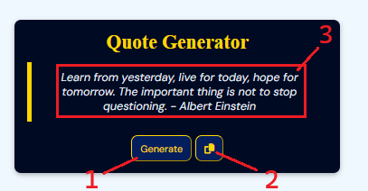

# QuoteGen
 Simple random quote generator website

# How to use

1. Genrate button, fetches a new quote form an quote API
2. Copy button, coppies a quote to the clipboard
3. Quote along with an author

# Inspiration and future improvement
The idea for the project was inspired by this video https://www.youtube.com/watch?v=3Wa57T2jVRU. This is a very simple web application. My concept was to create inspirational images with those quotes in web, using API to fetch quotes. For now however I was unable to find suitable Quote API for this task, so I scramble the project untill I create my own.